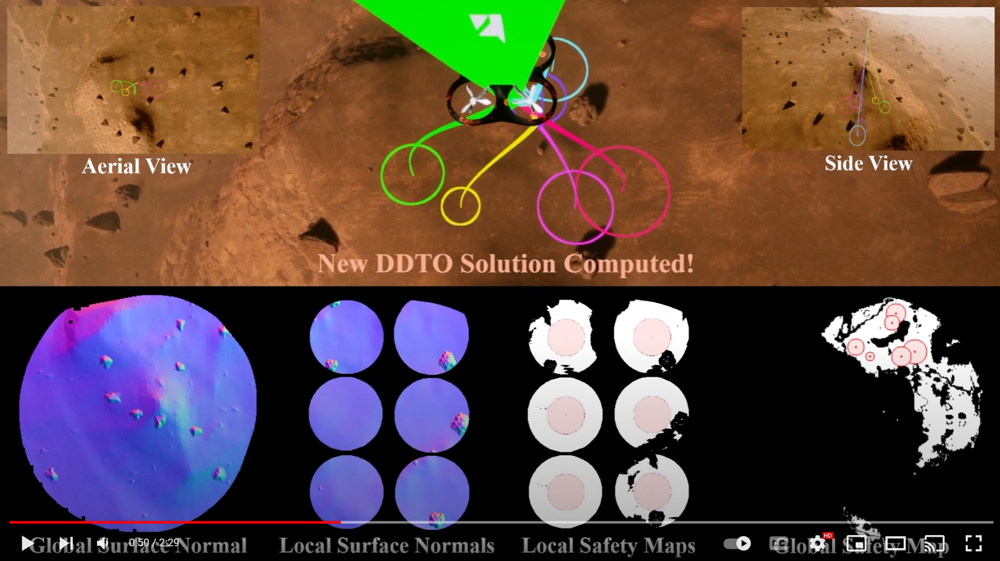

# HALO: Hazard-Aware Landing Optimization for Autonomous Systems

[](https://www.youtube.com/watch?v=KqCXGDTntDU&ab_channel=AutonomousControlLaboratory "HALO: Hazard Aware Landing Optimization for Autonomous Systems (ICRA 2023)")

## Abstract
**(See the full paper [here]([https://arxiv.org/abs/2304.01583](https://ieeexplore.ieee.org/document/10160655)))**

With autonomous aerial vehicles enacting safety-critical missions, such as the Mars Science Laboratory Curiosity rover's landing on Mars, the tasks of automatically identifying and reasoning about potentially hazardous landing sites is paramount. This paper presents a coupled perception-planning solution which addresses the hazard detection, optimal landing trajectory generation, and contingency planning challenges encountered when landing in uncertain environments. Specifically, we develop and combine two novel algorithms, Hazard-Aware Landing Site Selection (HALSS) and Adaptive Deferred-Decision Trajectory Optimization (Adaptive-DDTO), to address the perception and planning challenges, respectively. The HALSS framework processes point cloud information to identify feasible safe landing zones, while Adaptive-DDTO is a multi-target contingency planner that adaptively replans as new perception information is received. We demonstrate the efficacy of our approach using a simulated Martian environment and show that our coupled perception-planning method achieves greater landing success whilst being more fuel efficient compared to a nonadaptive DDTO approach.

## Overview
This repository contains submodules to both the **Hazard-Aware Landing Site Selection (HALSS)** and **Adaptive Deferred-Decision Trajectory Optimization (Adaptive-DDTO)** repositories, as well as code to interface these submodules together in the **AirSim** environment. In each aforementioned submodule repository, you will find a 📜`demo.ipynb` file that illustrates how each algorithm works. Results from the full paper cannot be precisely replicated at this time, as the full HALO environment assets cannot be made public, however instructions are provided below to enable simulation in a similar environment with a provided digital elevation map (DEM).

## Setup

### Software Requirements:
* Unreal Engine version 4.27.2 (see setup instructions [here](https://www.unrealengine.com/en-US/free-download/game-development-engine?utm_source=GoogleSearch&utm_medium=Performance&utm_campaign=20121040491&utm_id=150460841753&utm_term=video%20game%20engines&utm_content=669868333880))
* Microsoft AirSim platform (see setup instructions [here](https://microsoft.github.io/AirSim/))
* Julia -- latest version (see setup instructions [here](https://julialang.org/downloads/))
* Anaconda -- latest version (see setup instructions [here]([https://www.anaconda.com/](https://www.anaconda.com/download)))

### Environment Configuration:
TBD (will use `Airsim/setup/halo_depthmap.png`)

### Other Steps:
The settings file provided at `AirSim/setup/settings.json` must be relocated on a Windows machine to the path `C:/Documents/AirSim/settings.json` as per AirSim setup instructions. 

Additionally, a new Anaconda ("conda") environment must be created using the `environment.yaml` file with the following commmand:
```
conda env create -f environment.yml
```

## Citing
If you use either of the aforementioned algorithms, kindly cite the following associated publication.
```
@inproceedings{hayner2023halo,
  title={HALO: Hazard-Aware Landing Optimization for Autonomous Systems},
  author={Hayner, Christopher R and Buckner, Samuel C and Broyles, Daniel and Madewell, Evelyn and Leung, Karen and A{\c{c}}ikme{\c{s}}e, Beh{\c{c}}et},
  booktitle={2023 IEEE International Conference on Robotics and Automation (ICRA)},
  pages={3261--3267},
  year={2023},
  organization={IEEE}
}
```
